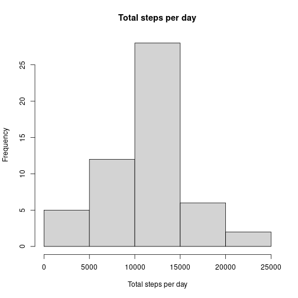
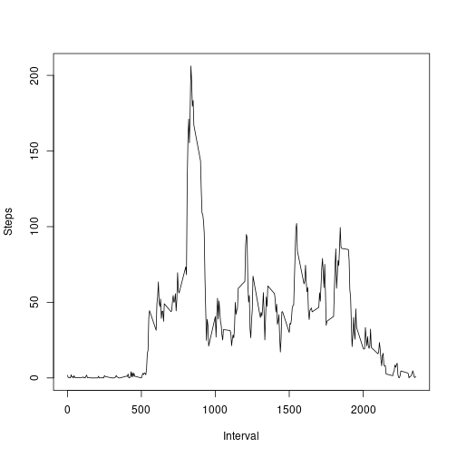
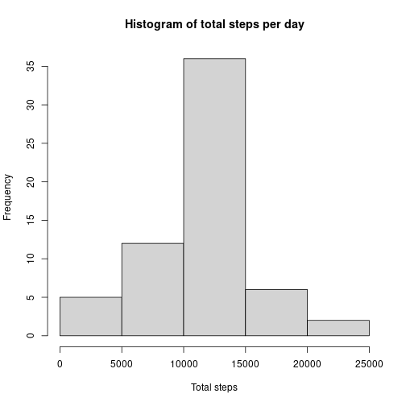
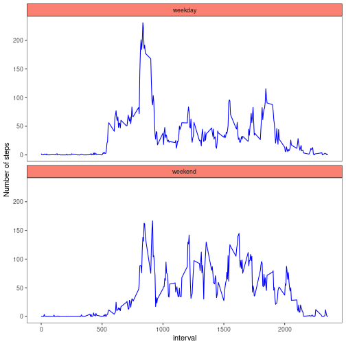

Let's analyse some steps per days, intervals and type of weekday
=================


```r
library(ggplot2)
library(dplyr)
```

## Let's get some data

We're going to analyse data from quantified selfers. For that purpose we can fork RD Peng's github repository <http://github.com/rdpeng/RepData_PeerAssessment1>, where the data are already available as activity.zip. We can alternatively download them using download.file and unzip them. Let's read them once we've forked the repository or downloaded them


```r
datos<-read.csv("activity.csv",h=T)
```

## What is mean total number of steps taken per day?

We're going to ignore the missing data for the time being

# Calculate the total number of steps taken per day


```r
totalstepsday<-aggregate(steps~date,datos,sum,na.rm=T)
totalstepsday
```

# Make a histogram of the total number of steps taken each day


```r
hist(totalstepsday$steps,main="Total steps per day",xlab="Total steps per day")
```




# Calculate and report the mean and median of the total number of steps taken per day


```r
mean(totalstepsday$steps)
```

```
## [1] 10766.19
```

```r
median(totalstepsday$steps)
```

```
## [1] 10765
```

## What is the average daily activity pattern?

Make a time series plot (i.e. type = "l") of the 5-minute interval (x-axis) and the average number of steps taken, averaged across all days (y-axis)


```r
agg<-aggregate(steps~interval,datos,mean,na.rm=T)
plot(agg$interval,agg$steps,type="l",xlab="Interval",ylab="Steps")
```



Which 5-minute interval, on average across all the days in the dataset, contains the maximum number of steps?


```r
agg[which.max(agg$steps),]$interval
```

```
## [1] 835
```

## Imputing missing values

The presence of missing days may introduce bias into some calculations or summaries of the data.

# Calculate and report the total number of missing values in the dataset


```r
sum(is.na(datos))
```

```
## [1] 2304
```

# Devise a strategy for filling in all of the missing values in the dataset.

I have chosen to take the mean for that interval and round it to the nearest integer.


```r
datos2=datos
for (i in 1:nrow(datos2)) {
  if(is.na(datos2$steps[i])){
    #print(datos2$interval[i])
    datos2$steps[i]=round(agg[agg$interval==datos2$interval[i],]$steps)
    }
}
```

# Create a new dataset that is equal to the original dataset but with the missing data filled in.

The new dataset is datos2, as I've done the two tasks in one go.

Make a histogram of the total number of steps taken each day and calculate and report the mean and median total number of steps taken per day. 


```r
aggdatos2<-aggregate(steps~date,datos2,sum)
hist(aggdatos2$steps,xlab="Total steps",main="Histogram of total steps per day")
```




```r
mean(aggdatos2$steps)
```

```
## [1] 10765.64
```

```r
median(aggdatos2$steps)
```

```
## [1] 10762
```
From the mean and median in the new dataset I do not observe large differences.

## Are there differences in activity patterns between weekdays and weekends?

Here we are going to use the weekdays() function to figure out what day of the week each day in the dataset is. We'll be working with the dataset without missing data.

# Create a new factor variable in the dataset with two levels – “weekday” and “weekend” indicating whether a given date is a weekday or weekend day.


```r
wdays<-weekdays(as.Date(datos2$date,"%Y-%m-%d"))
daytype=factor(wdays,levels=c("weekday","weekend"))
weekend=c("Saturday","Sunday")
weekday=c("Friday","Monday","Tuesday","Wednesday","Thursday","Friday")
for (i in 1:length(wdays)){
  if(wdays[i] %in% weekend){daytype[i]=as.factor("weekend")}
  if(wdays[i] %in% weekday){daytype[i]=as.factor("weekday")}
}

datos2$daytype=daytype
```

# Make a panel plot containing a time series plot (i.e. type = "l") of the 5-minute interval (x-axis) and the average number of steps taken, averaged across all weekday days or weekend days (y-axis). 


```r
stepsday<-aggregate(steps~daytype+interval,datos2,mean)
p<-ggplot(stepsday,aes(interval,steps))+geom_line(colour="blue")
pp<-p+facet_wrap(~daytype,nrow=2)+theme_bw()+theme(panel.grid=element_blank(),panel.background = element_blank())+theme(strip.background = element_rect(colour="black",fill="salmon"))
pp+ylab("Number of steps")
```



Since we'll need the figures in a separate folder, let's create it


```r
dir.create("figure/")
```

```
## Warning in dir.create("figure/"): 'figure' already exists
```

```r
png(filename="figure/HistogramTotalSteps.png")
hist(totalstepsday$steps,main="Total steps per day",xlab="Total steps per day")
dev.off()
```

```
## png 
##   2
```

```r
#
png(filename = "figure/TotalStepsNoMissing.png")
hist(aggdatos2$steps,xlab="Total steps",main="Histogram of total steps per day")
dev.off()
```

```
## png 
##   2
```

```r
#
ggsave("figure/StepsWeekday.png",plot=pp+ylab("Number of steps"))
```

```
## Saving 7 x 7 in image
```

And let's produce the html with knit2html from the knitr package.

```r
library(knitr)
knit2html("PA1_template.Rmd")
```

```
## Warning: It seems you should call rmarkdown::render() instead of
## knitr::knit2html() because PA1_template.Rmd appears to be an R Markdown
## v2 document.
```

```
## 
## 
## processing file: PA1_template.Rmd
```

```
## 
  |                                                                   
  |                                                             |   0%
  |                                                                   
  |..                                                           |   3%
##   ordinary text without R code
## 
## 
  |                                                                   
  |....                                                         |   7%
## label: unnamed-chunk-37
## 
  |                                                                   
  |......                                                       |  10%
##   ordinary text without R code
## 
## 
  |                                                                   
  |........                                                     |  13%
## label: unnamed-chunk-38
## 
  |                                                                   
  |..........                                                   |  17%
##   ordinary text without R code
## 
## 
  |                                                                   
  |............                                                 |  20%
## label: unnamed-chunk-39
## 
  |                                                                   
  |..............                                               |  23%
##   ordinary text without R code
## 
## 
  |                                                                   
  |................                                             |  27%
## label: unnamed-chunk-40
```

```
## 
  |                                                                   
  |..................                                           |  30%
##   ordinary text without R code
## 
## 
  |                                                                   
  |....................                                         |  33%
## label: unnamed-chunk-41
## 
  |                                                                   
  |......................                                       |  37%
##   ordinary text without R code
## 
## 
  |                                                                   
  |........................                                     |  40%
## label: unnamed-chunk-42
```

```
## 
  |                                                                   
  |..........................                                   |  43%
##   ordinary text without R code
## 
## 
  |                                                                   
  |............................                                 |  47%
## label: unnamed-chunk-43
## 
  |                                                                   
  |..............................                               |  50%
##   ordinary text without R code
## 
## 
  |                                                                   
  |.................................                            |  53%
## label: unnamed-chunk-44
## 
  |                                                                   
  |...................................                          |  57%
##   ordinary text without R code
## 
## 
  |                                                                   
  |.....................................                        |  60%
## label: unnamed-chunk-45
## 
  |                                                                   
  |.......................................                      |  63%
##   ordinary text without R code
## 
## 
  |                                                                   
  |.........................................                    |  67%
## label: unnamed-chunk-46
```

```
## 
  |                                                                   
  |...........................................                  |  70%
##   ordinary text without R code
## 
## 
  |                                                                   
  |.............................................                |  73%
## label: unnamed-chunk-47
## 
  |                                                                   
  |...............................................              |  77%
##   ordinary text without R code
## 
## 
  |                                                                   
  |.................................................            |  80%
## label: unnamed-chunk-48
## 
  |                                                                   
  |...................................................          |  83%
##   ordinary text without R code
## 
## 
  |                                                                   
  |.....................................................        |  87%
## label: unnamed-chunk-49
```

```
## 
  |                                                                   
  |.......................................................      |  90%
##   ordinary text without R code
## 
## 
  |                                                                   
  |.........................................................    |  93%
## label: unnamed-chunk-50
```

```
## 
  |                                                                   
  |...........................................................  |  97%
##   ordinary text without R code
## 
## 
  |                                                                   
  |.............................................................| 100%
## label: unnamed-chunk-51
```

```
## output file: PA1_template.md
```
